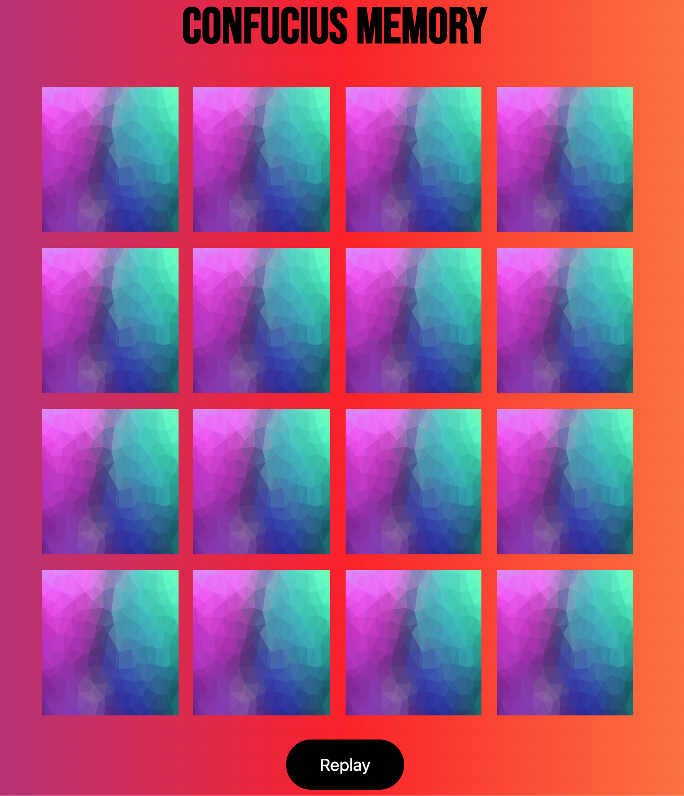

## FUZZYMEMORY
Memory created with HTML, CSS, JAVASCRIPT

## Requirements

* There should be at least 8 pairs and a maximum of 10 pairs of cards.
* The pairs should be randomly positioned before a new game starts (and on replay).
* The project should have a nice graphical user interface (meh).
* There should be a `replay` button to restart the game when finished.
* The game should look, feel and work similarly in Google Chrome and Mozilla Firefox.
* The project can't contain any errors, warnings or notices in the developer console.

## Getting started

* First you have to clone the repository Fuzzy Memory, either via [this link](https://github.com/vpuke/FUZZYMEMORY) in Github desktop or `git clone https://github.com/vpuke/FUZZYMEMORY.git`in the terminal of your choice.
* Secondly open index.html in your browser.

## Made by

* [Viktor Puke](https://github.com/vpuke) (WU19)

## Tested by

* [Viktor Sjöblom](https://github.com/viktorsjoblom)
* [Oskar Turesson](https://github.com/cleanly1)

## Code review

* Code is reviewed by [Erik Johannesson](https://github.com/erik-joh)
* bundle.js:14 Maybe rename shuffleCards to duplicatedCards
* bundle.js:32,38,45 Add some comments for these functions
* bundle.js:62 Rename x and j to something more describing
* <strike>bundle.js:74-84 It is now possible to click the same card twice.
  could maybe be fixed by adding another statement to the if statement</strike>
* bundle.js:22 rename first and second to something more describing. 

## License

This project is licensed under MIT license, please see further details [here](https://github.com/Vpuke/FUZZYMEMORY/blob/master/LICENSE).
